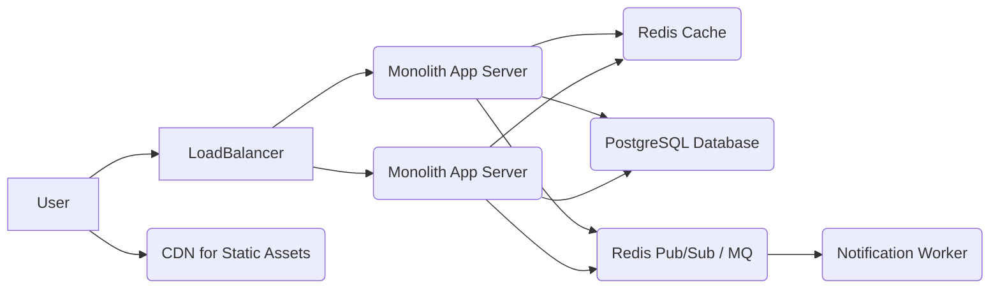

# Module 2: Architectural Choices & Patterns

## Practical: Architectural Design Case Study (Non-Coding)

This practical exercise will walk you through the process of applying architectural decision-making to a hypothetical new system. Our goal is not to write code, but to practice the thought process, articulate design choices, and justify them based on requirements.

---

### Case Study: A Simplified "TaskFlow" Freelance Platform

**Scenario:** You're tasked with designing the backend architecture for a new freelance platform called "TaskFlow." It connects clients who need tasks done with freelancers who can perform them.

---

### 1. Understanding Requirements (Gathering & Prioritization)

Let's assume the following initial requirements:

**Functional Requirements:**
*   **User Management:**
    *   Clients can register, create profiles (company name, contact info).
    *   Freelancers can register, create profiles (skills, portfolio, hourly rate).
    *   Authentication (login/logout).
*   **Task Management:**
    *   Clients can post new tasks with title, description, budget, required skills, and deadline.
    *   Freelancers can browse available tasks and filter by skills, budget.
    *   Freelancers can apply to tasks.
    *   Clients can accept/reject applications.
*   **Messaging:**
    *   Clients and freelancers can communicate via an in-app chat for specific tasks.
*   **Reviews & Ratings:**
    *   After a task is completed, clients can rate and review freelancers.
*   **Notifications:**
    *   Notify clients about new applications for their tasks.
    *   Notify freelancers about new tasks matching their skills.
    *   Notify users about new chat messages.

**Non-Functional Requirements (NFRs) - Initial Assumptions:**
*   **Scalability:**
    *   Target 100,000 active users (clients + freelancers) within 1 year.
    *   Peak concurrency: 10,000 concurrent users.
    *   Tasks per day: 5,000 new tasks.
    *   Messages per day: 50,000.
*   **Availability:** High availability (e.g., 99.9% uptime).
*   **Performance:**
    *   Page load time: < 2 seconds for critical pages (task lists, profile).
    *   Real-time chat messaging: < 500ms latency.
*   **Security:** Strong authentication, data encryption, protection against common web vulnerabilities.
*   **Maintainability:** Easy to add new features and fix bugs.
*   **Time-to-Market:** Need a working MVP within 6-9 months.
*   **Team Size:** Initial team of 5-7 backend developers.
*   **Budget:** Moderate startup budget for infrastructure and development.

---

### 2. High-Level Design (HLD) - Initial Architectural Choice

Given the NFRs, especially the need for rapid time-to-market, a moderate team size, and an initial target scale that isn't astronomical, a **well-modularized Monolithic Architecture** seems like the most pragmatic starting point.

**Justification for Monolith First:**
*   **Time-to-Market:** Monoliths are faster to develop and deploy initially, allowing us to validate the product concept quickly.
*   **Team Size:** A 5-7 person team can manage a monolith effectively without excessive communication overhead.
*   **Complexity Management:** Avoids the significant operational and architectural complexity of microservices when requirements might still be evolving.
*   **Cost-Effectiveness:** Lower infrastructure and operational costs for an MVP.
*   **Evolvability:** We can plan for future extraction using the Strangler Fig Pattern if scaling demands it.

**Core Components & Interactions (Monolith):**

*   **User Interface (Frontend):** A single-page application (SPA) using React/Vue/Angular, or a traditional server-rendered application. This will communicate with the backend via RESTful APIs.
*   **Backend Application (Monolith):** A single application (e.g., Django, Ruby on Rails, Node.js/Express) containing all business logic.
*   **Database:** A single relational database (e.g., PostgreSQL) for all persistent data.
*   **Caching Layer:** (e.g., Redis) to speed up frequently accessed data.
*   **Messaging Queue/System:** (e.g., Redis Pub/Sub or a lightweight message broker) for real-time chat and asynchronous notifications.
*   **Load Balancer:** To distribute incoming traffic across multiple instances of the monolith.
*   **CDN:** For serving static assets (CSS, JS, images).

**High-Level Diagram:**

---

### 3. Detailed Design (LLD) - Key Considerations within the Monolith

Now, let's drill down into some critical aspects within our chosen monolithic architecture.

#### a. Data Model (Database Schema - Conceptual)

We'd design a relational schema for PostgreSQL:

*   **`User` Table:** `id`, `username`, `email`, `password_hash`, `is_client`, `is_freelancer`, `created_at`, `updated_at`.
*   **`ClientProfile` Table:** `id`, `user_id (FK)`, `company_name`, `contact_person`, `phone`, `address`.
*   **`FreelancerProfile` Table:** `id`, `user_id (FK)`, `skills (JSONB or separate table)`, `portfolio_url`, `hourly_rate`, `bio`.
*   **`Task` Table:** `id`, `client_id (FK)`, `title`, `description`, `budget_min`, `budget_max`, `status`, `deadline`, `created_at`.
*   **`TaskApplication` Table:** `id`, `task_id (FK)`, `freelancer_id (FK)`, `cover_letter`, `status`, `applied_at`.
*   **`Conversation` Table:** `id`, `task_id (FK)`, `participant1_id (FK)`, `participant2_id (FK)`.
*   **`Message` Table:** `id`, `conversation_id (FK)`, `sender_id (FK)`, `content`, `sent_at`.
*   **`Review` Table:** `id`, `task_id (FK)`, `reviewer_id (FK)`, `reviewee_id (FK)`, `rating`, `comment`, `created_at`.
*   **`Skill` Table:** `id`, `name`. (`FreelancerProfile_Skills` join table).

#### b. API Design (RESTful)

The frontend will interact with the backend via RESTful JSON APIs.

*   `GET /api/users/{id}`
*   `POST /api/tasks` (Client creates task)
*   `GET /api/tasks` (Freelancer browses tasks - with filters)
*   `POST /api/tasks/{id}/apply` (Freelancer applies)
*   `POST /api/tasks/{id}/applications/{app_id}/accept` (Client accepts)
*   `GET /api/conversations/{id}/messages`
*   `POST /api/conversations/{id}/messages` (Real-time via WebSocket upgrade or polling)
*   `POST /api/tasks/{id}/reviews` (Client reviews freelancer)

#### c. Authorization Strategy

*   **Django's Built-in Auth:** For user authentication and session management.
*   **Permissions/Groups:** Use `is_client`, `is_freelancer` flags on the user for role-based access. Create groups for special roles (e.g., "Moderators" if needed).
*   **Object-Level Checks:** Crucial for task management (`task.client == request.user`, `application.freelancer == request.user`).
*   **Middleware:** Global `LoginRequiredMiddleware` to protect most endpoints, as demonstrated in Module 1.

#### d. Real-time Messaging

*   **WebSockets:** For real-time chat, traditional HTTP polling is inefficient. We'd integrate WebSockets (e.g., Django Channels if using Django, or a dedicated WebSocket server like Node.js) for live message delivery. This would be part of the monolith but could be a separate process.
*   **Message Queue:** Messages would be published to a message queue, and then routed to active WebSocket connections or stored for offline users.

#### e. Asynchronous Notifications

*   **Background Tasks:** Sending email notifications (e.g., "new application," "task accepted") should not block the user interface. Use a task queue (e.g., Celery with Redis/RabbitMQ) to offload these tasks.
*   **Webhooks:** For external integrations (e.g., sending SMS via Twilio).

---

### 4. Scalability and Reliability Considerations

Even with a monolith, we need to plan for growth:

*   **Load Balancer:** Distribute traffic to multiple application server instances.
*   **Multiple App Instances:** Run several copies of the monolithic application behind the load balancer.
*   **Database Scaling:**
    *   **Vertical Scaling:** Upgrade the database server (more CPU, RAM).
    *   **Read Replicas:** Use PostgreSQL read replicas to distribute read load for frequently accessed data (e.g., browsing tasks).
*   **Caching:** Extensive use of Redis for:
    *   Session storage.
    *   Frequently accessed task lists or user profiles.
    *   Rate limiting.
*   **Asynchronous Processing:** Offload non-critical, time-consuming tasks to background workers (Celery).

---

### 5. Future Evolution (Strangler Fig Pattern)

If TaskFlow grows significantly and certain parts become bottlenecks or require different scaling characteristics (e.g., real-time messaging, notification service), we could extract them:

1.  **Extract Notification Service:** Create a separate microservice responsible for all notifications (email, SMS, in-app push). The main monolith would publish events (e.g., `TaskAppliedEvent`) to a message queue, and the Notification Service would consume them.
2.  **Extract Messaging Service:** Build a dedicated real-time messaging microservice (potentially using a different stack optimized for WebSockets) to handle all chat functionality, offloading this specialized load from the main application.

---

### Conclusion

This case study demonstrates how to approach an architectural design problem. We started with requirements, chose a pragmatic initial architecture (modular monolith) based on those requirements, sketched out key internal components, and considered how to scale and evolve it. The focus was on making justified decisions and understanding the trade-offs involved.

---
**Your Turn:**
*   Imagine TaskFlow becomes wildly successful. How would the NFRs change?
*   How might you re-evaluate the architectural choice if:
    *   The team grew to 50+ developers?
    *   Real-time chat became the *most critical* feature, needing extremely low latency and high reliability?
    *   The platform expanded to include complex payment processing requiring PCI compliance?
*   Sketch out a diagram for a purely microservices-based TaskFlow. What would be the new services, and how would they communicate?